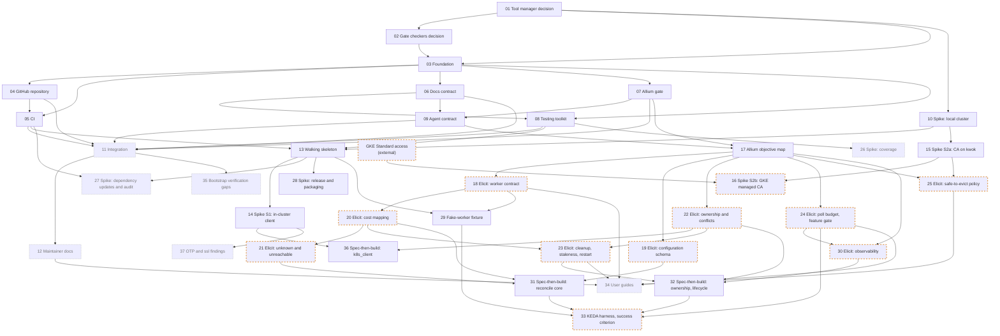

# Bootstrap round: ticket order

The tickets live in [issues/](issues/). Each arrow points from a blocker to the ticket it unblocks, exactly as the ticket's **Blocked by** line states. A dashed orange border marks a `needs-human` ticket (a live session with the maintainer) or an external dependency. A dotted grey border marks a ticket off the MVP critical path.

## Branches

Each ticket is worked on its own branch, in its own git worktree. The branch name is the ticket's file name without `.md`, so [03](issues/03-foundation.md) is worked on `03-foundation`. Ticket 03 fixed this convention, and the root [README](../../README.md#branches-and-worktrees) states it with the worktree rules.

## Execution waves

A wave is the earliest point a ticket can start if every lane runs in parallel: one step after its latest blocker. `needs-human` tickets also wait for a maintainer session.

| Wave | Tickets |
| --- | --- |
| 0 | [01](issues/01-tool-manager-decision.md) |
| 1 | [02](issues/02-gate-checkers-decision.md), [10](issues/10-spike-local-cluster.md) |
| 2 | [03](issues/03-foundation.md), [15](issues/15-spike-s2a-ca-on-kwok.md) |
| 3 | [04](issues/04-github-repository.md), [06](issues/06-docs-contract-and-decisions.md), [07](issues/07-allium-gate.md), [16](issues/16-spike-s2b-gke-managed-ca.md) |
| 4 | [05](issues/05-ci.md), [08](issues/08-testing-toolkit.md), [09](issues/09-agent-contract.md) |
| 5 | [11](issues/11-integration.md), [13](issues/13-walking-skeleton.md), [17](issues/17-allium-objective-map.md), [26](issues/26-spike-coverage.md) |
| 6 | [12](issues/12-maintainer-docs.md), [14](issues/14-spike-s1-in-cluster-client.md), [18](issues/18-elicit-worker-contract.md), [19](issues/19-elicit-configuration-schema.md), [22](issues/22-elicit-ownership-and-conflicts.md), [24](issues/24-elicit-poll-budget-feature-gate.md), [25](issues/25-elicit-safe-to-evict-policy.md), [27](issues/27-spike-dependency-updates-and-audit.md), [28](issues/28-spike-release-and-packaging.md), [35](issues/35-bootstrap-verification-gaps.md) |
| 7 | [20](issues/20-elicit-cost-mapping.md), [29](issues/29-fake-worker-fixture.md), [30](issues/30-elicit-observability.md), [36](issues/36-k8s-client-spec-then-build.md), [37](issues/37-otp-ssl-findings.md) |
| 8 | [21](issues/21-elicit-unknown-unreachable-policy.md), [23](issues/23-elicit-cleanup-staleness-restart.md) |
| 9 | [31](issues/31-spec-then-build-reconcile-core.md), [32](issues/32-spec-then-build-ownership-lifecycle.md), [34](issues/34-user-guides.md) |
| 10 | [33](issues/33-keda-harness-success-criterion.md) |

The longest chain is eleven tickets: 01, 02, 03, 06 or 07, 09, 17, 18, 20, 21 or 23, then 31 or 32, then 33. Tickets 30 to 34 are the follow-ups ticket 17 drafted; 31 to 34 are round 2. Tickets 36 and 37 are the follow-ups ticket 14 drafted.

When a ticket's **Blocked by** line changes, update both the diagram and this table.
