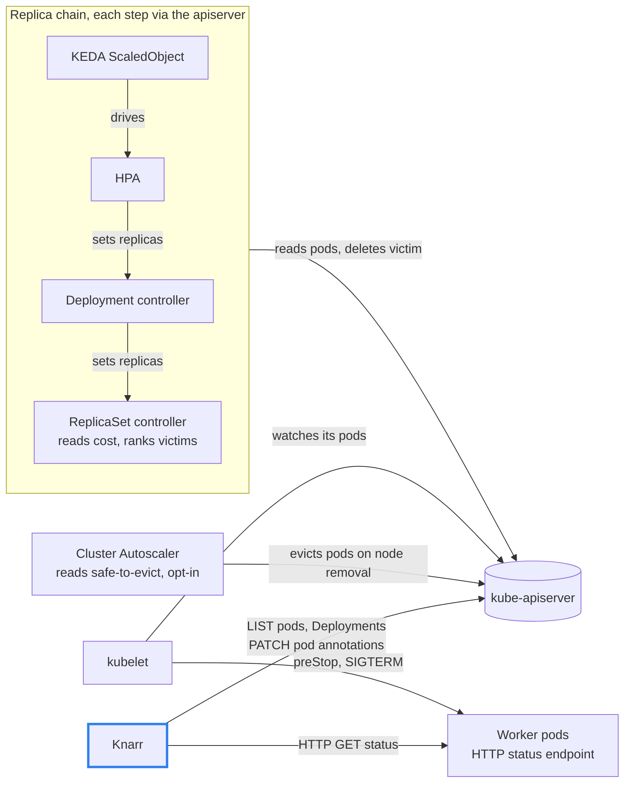
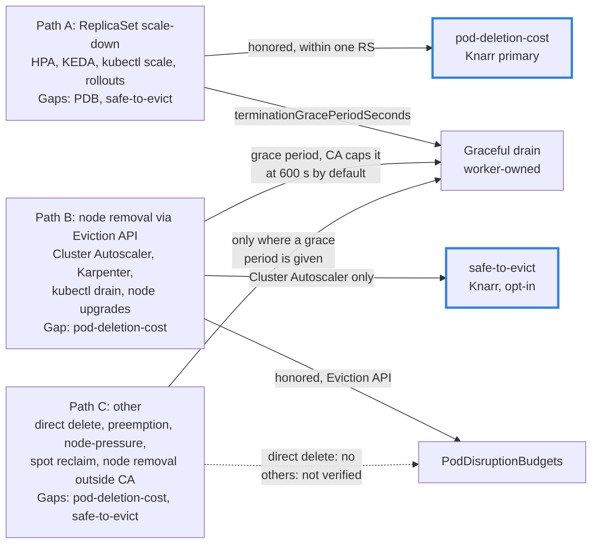
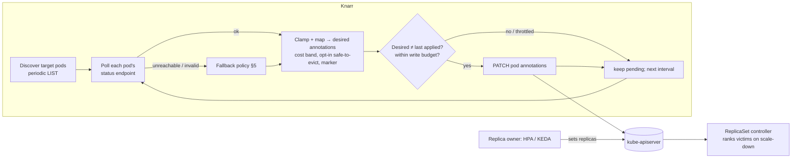
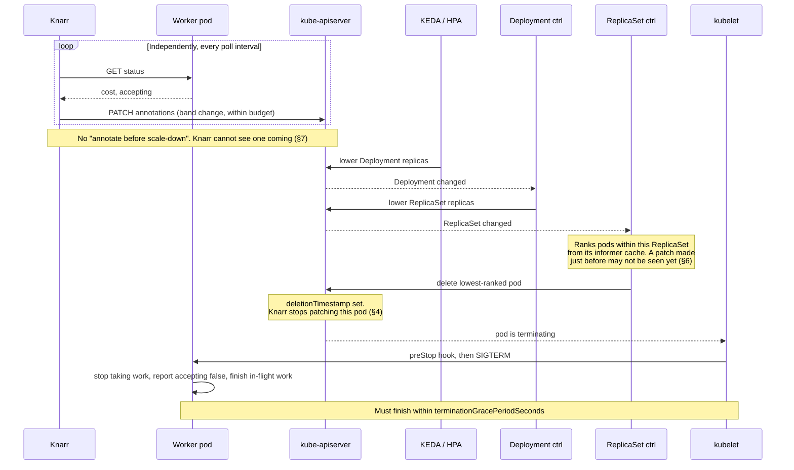
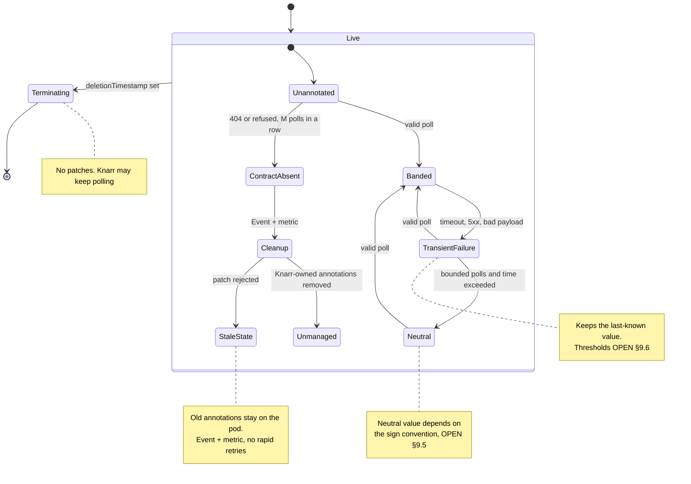
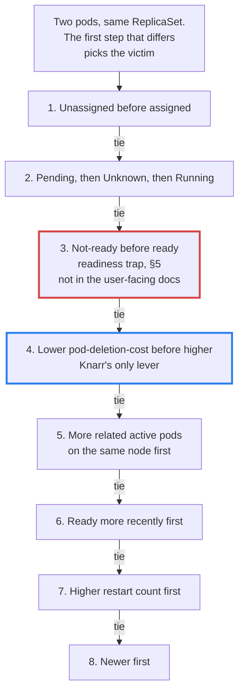
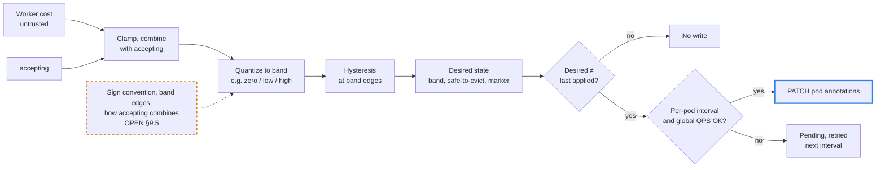
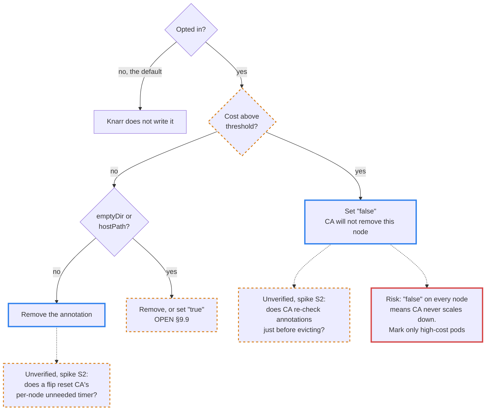
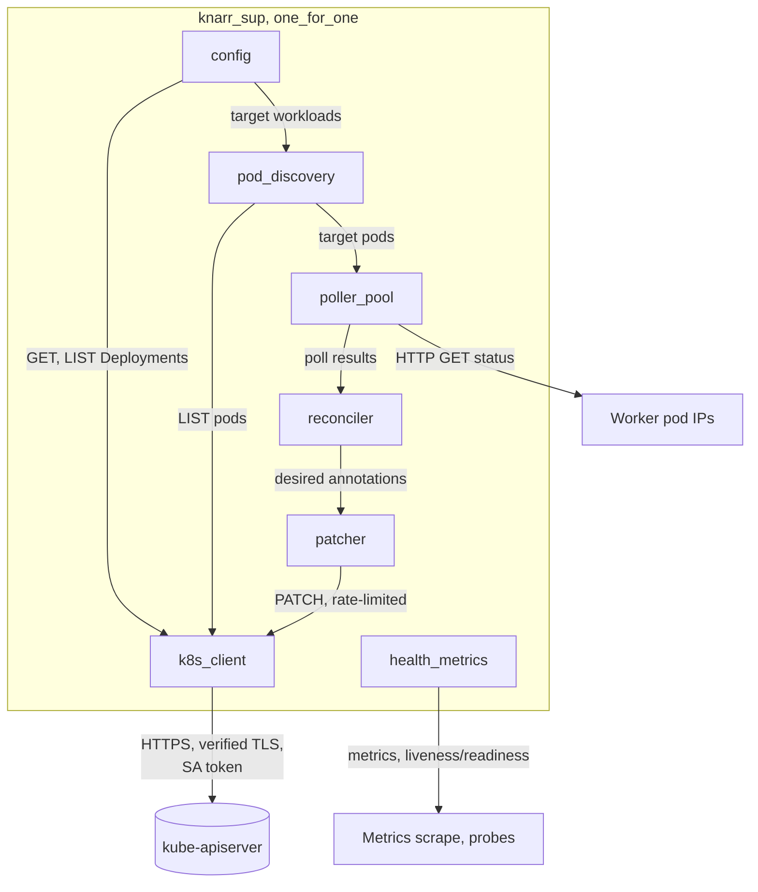
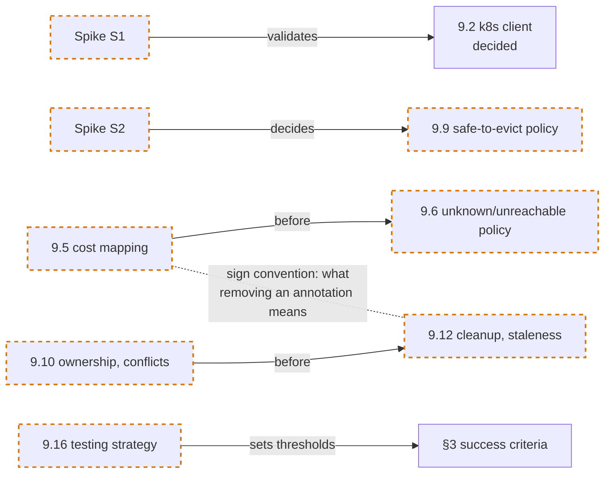

# Knarr: Project Overview

> **Status:** Draft, scoped to the MVP. This document sets a high-level direction for later work and for drafting tickets. It is not a specification. Anything marked **OPEN** has not been decided and will be settled in a ticket. **Recommended** means a proposed default, not a decision. Post-MVP options, alternatives and research notes live in [DEFERRED.md](DEFERRED.md).
>
> **Diagrams** only restate what the text says. A thick blue border marks what Knarr controls, a dashed orange border marks OPEN or unverified items, and a red border marks a risk or trap. A visual explainer for the densest parts (victim ranking, cost bands and sign convention, kill paths) is in [overview-explainer.html](overview-explainer.html). GitHub shows that file as source, so open it locally in a browser.

## 1. Summary

Knarr is a Kubernetes controller written in [Gleam](https://gleam.run/) that runs on the BEAM (Erlang target). It is for autoscaled worker fleets that run a mix of very quick tasks and long-running jobs. Knarr polls an HTTP status endpoint on each worker pod and uses the result to set `controller.kubernetes.io/pod-deletion-cost` on that pod. When a Deployment scales down, Kubernetes then prefers to remove idle or cheap pods over busy ones, as long as the pods are otherwise equal (scheduled, Running and Ready; see §6). This is a **best-effort bias**, not a guarantee. Knarr is meant to be generic: any worker that implements a small HTTP contract can take part.



### MVP at a glance

| Item | Status | Where |
| --- | --- | --- |
| Target platform: GKE Standard; MVP bar is running a real production workload | Decided | §6 |
| Runtime: Gleam on the BEAM (Erlang target) | Decided | §8 |
| Workload kind: Deployments only | Decided | §3 |
| Primary mechanism: `pod-deletion-cost` on live Pod objects | Decided | §6 |
| Guarantee level: best-effort bias only; graceful drain is the safety net | Decided | §3, §5 |
| Worker contract: pull (Knarr polls each pod over HTTP) | Decided | §5 |
| v1 payload: worker-supplied cost and accepting/drain state, nothing else | Decided | §5 |
| `safe-to-evict`: in MVP, opt-in per workload; policy in §9.9 | Decided | §6, §9.9 |
| Karpenter: not a target | Decided | §3 |
| Prerequisite: Kubernetes 1.22 or later with the `PodDeletionCost` gate enabled (the default) | Fact | §6 |
| Scaling ownership: option (a), annotations only; (b) is a planned quick follow | Decided | §7, §9.3 |
| Configuration: labels and annotations on Deployments (a controller, not an operator) | Decided | §9.1 |
| k8s client: option (A), pure Gleam plus Erlang FFI | Decided | §8, §9.2 |
| Pod discovery: periodic LIST | Decided | §4 |
| HA model: single replica, no leader election | Decided | §8, §9.19 |
| Install scope: one namespace (Role) | Decided | §9.18 |
| Packaging: kustomize only; the image on GHCR, installed pinned by digest | Decided | §9.15 |

## 2. Problem

### Mixed workloads and naive scale-down

Worker fleets often handle two kinds of work in the same pods:

- **Quick tasks** (milliseconds to seconds). Losing one costs little.
- **Long-running jobs** (minutes to hours). Killing one partway through wastes the work and may mean a retry or manual cleanup.

Autoscalers such as HPA and KEDA (ScaledObject) decide **how many** replicas to run. They do not decide **which** pod is removed. The ReplicaSet controller picks the victim, and by default it knows nothing about in-flight work. Two related problems follow:

- **Backlog-only metrics hide in-flight work.** A queue-length metric can drop to zero while pods are still busy with long jobs, so the autoscaler scales in on busy workers (see kedacore/keda #2901, #6719). This is a "how many" problem. The MVP uses option (a) (§7), which does not address it. The planned option (b) follow-up does ([DEFERRED.md §1](DEFERRED.md#1-scaling-option-b-quick-follow)).
- **KEDA's own guidance for long work on Deployments** is SIGTERM handling, `terminationGracePeriodSeconds` and `preStop` hooks, or switching to ScaledJob. None of these affects which pod is chosen.

### Several paths can kill a pod

| Path | Triggered by | Honors `pod-deletion-cost` | Honors PDBs | Honors `safe-to-evict` |
| --- | --- | --- | --- | --- |
| **A. ReplicaSet scale-down** | HPA, KEDA, `kubectl scale`, Deployment rollouts | Yes, within one ReplicaSet | No (direct delete) | No |
| **B. Node removal through the Eviction API** | Cluster Autoscaler, Karpenter, `kubectl drain`, node upgrades | No (Karpenter may read it for consolidation scoring, see [DEFERRED.md §7](DEFERRED.md#7-karpenter)) | Yes (Eviction API) | Cluster Autoscaler only (GKE has its own behavior); not Karpenter or `kubectl drain` |
| **C. Other** | Direct pod delete, scheduler preemption, kubelet node-pressure eviction, spot or instance reclaim, node removal outside CA | No | Direct delete: no. Others: not verified here | No |



Knarr's primary mechanism covers **Path A**. In the MVP, `safe-to-evict` is the only per-pod lever Knarr uses on Path B, and it only works where Cluster Autoscaler removes nodes. Busy-label PDBs and `karpenter.sh/do-not-disrupt` are future options (§9.17). On Path C, only the worker's own graceful drain protects work, and only where a grace period is given at all.

### What Kubernetes gives us, and its limits

`controller.kubernetes.io/pod-deletion-cost` ([KEP-2255](https://github.com/kubernetes/enhancements/blob/master/keps/sig-apps/2255-pod-cost/README.md)) lets something outside the ReplicaSet controller rank pods for deletion. Its limits:

- It is **best-effort**. The docs say it "does not offer any guarantees on pod deletion order".
- It is a **tiebreaker**. It is only compared after node assignment, phase and readiness (§5 readiness trade-off, §6 ranking).
- It is **per-ReplicaSet**. It cannot steer which ReplicaSet loses replicas during a rollout.
- The KEP leaves a cost-setting controller out of scope (a non-goal) and expects users to deploy their own. It also warns that frequent updates load the API server and asks for coarse-grained updates. Knarr is such an external controller, so its design must answer that warning (§6).

## 3. Goals and Non-goals (v1)

### Goals

- Bias Deployment scale-down toward idle or cheap pods by setting `pod-deletion-cost` on live Pod objects.
- Define a small, generic, pull-based **worker contract** (an HTTP status endpoint).
- Keep API-server load low: patch only on meaningful change, quantize costs, and rate-limit writes.
- Work alongside existing autoscalers (KEDA, HPA), which own the replica count (option (a), §7).
- **Opt-in per workload:** manage `cluster-autoscaler.kubernetes.io/safe-to-evict`, which only matters where Cluster Autoscaler is used, including its cleanup, expiry and staleness handling (§6, §9.9, §9.12).
- Document the limits plainly, along with the graceful-drain practices workers still need.

### Non-goals (v1)

- **A hard guarantee that busy pods are never killed.** If every pod is busy, or costs are stale, a busy pod can still be removed. The real safety net is `terminationGracePeriodSeconds` plus graceful drain in the worker. Users who need a hard guarantee should look at pod-per-job designs (KEDA ScaledJob) or at workload APIs that let you name the victim (for example OpenKruise CloneSet `podsToDelete`).
- **Deciding how many replicas run** (option (a)). The MVP influences which pod is removed, not how many. Scale-in on busy workers caused by backlog-only metrics is outside the MVP. The planned option (b) follow-up could help with a suitable aggregate metric (§7). HPA scale-down tuning only delays it.
- **StatefulSets, Jobs and DaemonSets.** Their controllers ignore `pod-deletion-cost` (StatefulSet removes pods by descending ordinal). Knarr should refuse or warn when pointed at them.
- **Karpenter.** Not a target; details in [DEFERRED.md §7](DEFERRED.md#7-karpenter).
- **Steering which ReplicaSet loses pods during a rollout.** The API does not allow this.
- **Managing PodDisruptionBudgets.** Possible later work, for example a label-selected PDB on busy pods.
- **Replacing the workload API.** Knarr works with plain Deployments.

### Success criteria (v1; thresholds set in §9.16)

- On a KEDA-scaled Deployment running a mixed fake-worker load on kind, fewer busy pods are killed on scale-in than in a baseline run without Knarr.
- The pod patch rate stays within the configured write budget.
- Restarting Knarr does not make annotations flap, and Knarr reconciles annotations it owns on startup after a crash. The exact restart semantics are set in §9.12.

## 4. How it works (conceptual)



1. **Discover.** Find the worker pods of Deployments opted in through labels and annotations, in Knarr's one namespace (§9.1, §9.18). Use a periodic LIST scoped by namespace and selector, on its own cadence and slower than polling. Watch deferred ([DEFERRED.md §6](DEFERRED.md#6-watch-based-discovery)).
2. **Poll.** Send an HTTP GET to each pod's status endpoint (§5). Keep the per-poll timeout shorter than the interval, jitter the schedule, never overlap two polls of the same pod, and bound concurrency.
3. **Map.** Treat the worker-supplied cost as untrusted input. Clamp it, combine it with the accepting state, and quantize it into a small number of cost bands. From these, derive the pod's full **desired annotation state**: the cost band, the opt-in `safe-to-evict` value, and Knarr's ownership marker.
4. **Patch only on meaningful change.** Compare the desired state with the last successfully applied state. That covers band changes, first annotation, startup repair, cleanup and `safe-to-evict` flips. Every annotation write goes through one rate-limited patcher, with a per-pod minimum interval and a global QPS budget. Changes that are throttled stay pending and are not dropped.
5. **Skip terminating pods.** Once a pod has `deletionTimestamp` set, the ReplicaSet no longer counts it, so Knarr stops patching it. Knarr may keep polling it for observability.

Knarr annotates **live Pod objects**, never the Deployment's pod template. Changing the template would trigger a rollout. Changing annotations on a running pod does not restart it.

### End-to-end scale-down

Knarr's loop runs on its own schedule. A scale-down reads whatever annotations the ReplicaSet controller's cache holds at that moment.



## 5. Worker contract v1 (DRAFT)

### Model

- **Pull.** Knarr polls an HTTP endpoint exposed by each worker pod. Workers do not push.
- The v1 payload carries **only** two things:
  1. **`cost`**: the worker's own estimate of the "cost to kill" it right now. Higher means more expensive to kill. The worker computes it; Knarr relays, clamps and maps it. Type, range and units are OPEN (§9.5).
  2. **`accepting`**: whether the worker is accepting new work. `false` means it is draining.
- More fields may come later. They are out of scope for v1.
- **Reachability:** Knarr must reach pod IPs on the status port. It polls over plain HTTP: no mTLS, and no service-mesh support in the MVP ([DEFERRED.md §8](DEFERRED.md#8-other-future-targets)). NetworkPolicies may need configuration; to be confirmed in §9.4b.

### Illustrative payload

> **DRAFT, illustrative only.** Path, port, field names, types and auth will be finalized in a ticket. How the contract is versioned is undecided (§9.4a). Any version marker lives outside the two-field body, for example in the URL path or a header.

```json
{
  "cost": 1800,
  "accepting": true
}
```

### Readiness trade-off: NotReady pods are deleted first

The ReplicaSet controller deletes a **NotReady pod before a Ready pod, whatever their costs**, because it compares readiness before deletion cost (`ActivePodsWithRanks.Less` in `controller_utils.go`). A worker that fails its readiness probe while busy or draining becomes the **preferred victim**. This has happened in practice ([discuss.kubernetes.io #25924](https://discuss.kubernetes.io/t/delete-k8s-pod-ready-but-with-higher-pod-deletion-cost-first/25924)).

Readiness also controls Service routing, so the right guidance depends on the kind of worker:

- **Queue consumers** (pull work, no Service traffic) should not use readiness to signal "busy" or "draining". Report `accepting` to Knarr instead.
- **Service-routed HTTP workers** may need to become NotReady to stop receiving requests while draining. `accepting: false` does not change routing. Going NotReady does weaken deletion-cost protection, so document the trade-off rather than forbid it.
- Guidance, and whether Knarr warns when a pod reports high cost while NotReady, is OPEN (§9.7).

### Drain states

`accepting: false` matters to Knarr only when the **worker starts the drain itself**, for example before a self-restart or when an operator asks it to drain through the worker's own API. Once Kubernetes terminates a pod (SIGTERM, `deletionTimestamp` set), the annotation no longer affects ReplicaSet scale-down and Knarr stops patching.

| `accepting` | `cost` | Terminating | Meaning | Candidate handling (OPEN, §9.5) |
| --- | --- | --- | --- | --- |
| true | low | no | Idle or running quick tasks only | Low band; preferred victim |
| true | high | no | Busy with expensive work | High band; biased against removal |
| false | high | no | Not accepting; expensive work remains | Biased against removal. One option: keep the reported cost, or apply a floor. Still best-effort. Kubernetes does not bound a drain the worker starts itself; the grace period applies only once termination begins |
| false | low | no | Not accepting; low remaining interruption cost (possibly fully drained) | Low band; preferred victim |
| any | any | yes | Being terminated | No patches; the worker's graceful shutdown applies |

By default Knarr does not override the worker's cost. A floor for draining pods is only a candidate rule for §9.5.

### Unreachable, invalid or absent endpoints

The intent is to keep any fallback bounded and **never treat missing data as "busy"**. If "no data" counts as busy, protection can pin pods or nodes indefinitely. A possible default, with thresholds set in §9.6:

- **Transient failure** (timeout, 5xx, payload that fails to parse): keep the last-known value for a bounded number of polls *and* a bounded time, then fall back to a neutral value. What "neutral" means depends on the sign convention (§9.5).
- **Contract absent** (404 or connection refused for M polls in a row since the pod started): treat the pod as unmanaged. Remove any annotations Knarr owns rather than simply stop writing, and emit a per-Deployment Event and metric.
- **Just started:** such pods are usually Pending or NotReady, so they are ranked first whatever their cost. Leave them at the implicit default until a valid poll.
- **Stale state outlives failures.** Stopping writes does not undo earlier ones. A high cost or `safe-to-evict: "false"` stays on the pod until Knarr removes it, so each Knarr-owned annotation needs an expiry and a cleanup attempt (§9.6, §9.12). If the API rejects the cleanup, the stale state persists. Raise an Event and a metric.
- With that cleanup working, an unreachable pod alone does not block scale-down for long.



### Workers still own graceful shutdown

Knarr only biases which pod is chosen. Workers must still:

- Handle **SIGTERM**: stop taking new work, report `accepting: false`, finish in-flight work, then exit.
- Use an **exec-form entrypoint** so SIGTERM reaches the worker process. A shell wrapper can swallow it.
- Set **`terminationGracePeriodSeconds` to at least the longest job plus drain time**. `preStop` time counts against this budget.
- For HTTP-fed workers, consider a `preStop` sleep to cover the race between endpoint removal and SIGTERM. Kubernetes has a native sleep action, beta from 1.30 and GA in 1.34.
- Expect very long grace periods to hold capacity during scale-down.
- Expect Cluster Autoscaler to cap graceful termination at `--max-graceful-termination-sec` (default 600 s) when it removes a **node**. On that path the grace period alone does not protect jobs longer than about 10 minutes.

## 6. Annotation semantics

### `controller.kubernetes.io/pod-deletion-cost` (primary)

| Aspect | Fact |
| --- | --- |
| Feature state | Alpha in 1.21. **Beta and on by default since 1.22.** Still beta in current `kube_features.go` (checked 2026-10). |
| Feature gate | `PodDeletionCost` on kube-controller-manager (the ReplicaSet docs also list kube-apiserver). Disabling it on the controller-manager turns off cost-aware ranking. It is hard to detect on managed clusters, so it is a documented prerequisite (§9.11). |
| Value | A string that parses as **int32** (`-2147483648`..`2147483647`). Unset means an implicit `0`. Negative values are allowed. |
| Format | Knarr emits **canonical signed decimal int32** strings only, such as `"-5"`, `"0"` or `"1800"`. With the gate on, the API server rejects some non-canonical forms, such as `"+5"` and `"007"`, and the whole patch then fails. Its validation is looser than canonical form and has exceptions, so do not rely on it. |
| Meaning | **Lower cost is deleted first**, compared only among pods of the **same ReplicaSet**. |
| Honored by | The ReplicaSet controller (and ReplicationController). Deployments are covered indirectly through their ReplicaSets, so HPA and KEDA scale-down go through this path. |
| Not honored by | StatefulSet, Job, DaemonSet, and Paths B and C (§2). |

**Victim ranking (conceptual).** This follows `ActivePodsWithRanks.Less`; a pod earlier in the list is selected for deletion first. The user-facing docs show a simplified list that leaves out step 3, so design from the source.

1. Unassigned before assigned
2. Pending, then Unknown, then Running
3. **Not-ready before ready** (§5 readiness trade-off)
4. **Lower `pod-deletion-cost` before higher**
5. More related active pods on the same node first
6. Ready more recently first
7. Higher restart count first
8. Newer first



Knarr only controls step 4. Tie-break details for the other steps are in [DEFERRED.md §9](DEFERRED.md#9-background-notes).

**Official caveats** ([ReplicaSet docs](https://kubernetes.io/docs/concepts/workloads/controllers/replicaset/#pod-deletion-cost), verbatim):

> This is honored on a best-effort basis, so it does not offer any guarantees on pod deletion order.
>
> Users should avoid updating the annotation frequently, such as updating it based on a metric value, because doing so will generate a significant number of pod updates on the apiserver.

The KEP recommends updating the cost "only before scale down" and keeping updates "coarse grained".

**Timing caveat.** The ReplicaSet controller reads pods from its informer cache, so it may not yet see a patch made just before a scale-down. The bias is best-effort in timing as well as in ordering.

**How Knarr limits update frequency:**

- **Quantize** the worker cost into a few bands (for example zero / low / high). A worker can fold job duration into the cost it reports. A separate field is needed only if Knarr must receive duration directly.
- **Patch only when the desired annotation state changes** (§4), with **hysteresis** on band edges so values near a boundary do not oscillate.
- Enforce a **minimum interval per pod** between patches, plus a **global patch QPS budget** and a documented expected write rate.
- Patch only `metadata.annotations`. An unconditional merge patch is idempotent, but it can overwrite a value another writer set after Knarr read the pod. Lost-update detection needs a conditional write, either a `resourceVersion` precondition or a JSON Patch `test` op. The choice is OPEN (§9.10).
- Every pod patch is an etcd write and a MODIFIED watch event for every watcher of that pod. Those watchers are the cluster-wide pod informers (controller-manager, scheduler, CA, KEDA and others) plus the kubelet on the pod's node. Cluster operators can throttle Knarr with API Priority and Fairness.



**Sign convention (OPEN, §9.5).** Unannotated pods count as `0`. Cost is compared whenever the earlier ranking steps tie, for example between two Ready pods or between two NotReady pods. The convention therefore decides how Knarr's bands compare with the implicit `0`. It is tied to the neutral fallback value (§9.6) and to what removing an annotation means (§9.12). Ready pods that Knarr has not annotated yet are the main example:

- If idle = `0`, those pods tie with idle pods.
- If idle < `0`, they rank after idle pods.
- If busy > `0`, busy pods are protected over them.

Choose deliberately, and reserve bands for Knarr's own states (for example unknown).

### `cluster-autoscaler.kubernetes.io/safe-to-evict` (opt-in, MVP)

Whether this matters **depends on cluster configuration**: it only has an effect where Cluster Autoscaler (CA) removes nodes. It does not affect Karpenter (which uses `karpenter.sh/do-not-disrupt`), `kubectl drain`, or ReplicaSet scale-down.

- `"false"` stops CA from removing the pod's node. `"true"` overrides CA's default blockers for kube-system pods, pods without a controller, and pods with local storage. It does not override scheduling constraints, and the Eviction API still enforces PDBs when the eviction is carried out. Knarr only manages `"false"` or removes the annotation (plus `"true"` if §9.9 calls for it). CA also recognizes other values (see [DEFERRED.md §8](DEFERRED.md#8-other-future-targets)). Check CA semantics against the CA version the cluster runs.
- **Unverified (spike S2):** whether CA re-checks pod annotations just before evicting. If it does, a flip to `"false"` that reaches CA's informer in time can save the node. A pod that picks up work just after a poll is unprotected until the next poll and patch. This is best-effort.
- **Decided:** off by default and enabled per workload. **Recommended (§9.9):** set `"false"` while the cost is above a threshold and remove the annotation when it drops below. For Deployment pods without local storage, removing it is enough. Pods with `emptyDir` or `hostPath` volumes may need `"true"` (or `safe-to-evict-local-volumes`) to be evictable when idle.
- **Risk: nodes may never scale down.** If `"false"` markers are spread across all nodes, CA never sees a node as unneeded, and CA does not cordon nodes because of such pods (kubernetes/autoscaler #3183). Mitigation: mark only high-cost pods, not every busy pod.
- **Unverified:** whether flipping a pod from busy to idle resets CA's per-node "unneeded" timer (default 10 min). See spike S2.
- **GKE:** the MVP targets GKE Standard, so spike S2 must run against GKE's managed Cluster Autoscaler. Other GKE modes are in [DEFERRED.md §8](DEFERRED.md#8-other-future-targets).



## 7. Scaling ownership: (a) for MVP

HPA or KEDA (ScaledObject) sets the replica count; Knarr only writes annotations. The primary mechanism works under any scaler, because HPA, KEDA and `kubectl scale` all end up at the ReplicaSet's victim ranking. Consequences:

- **No "annotate before scale-down".** Knarr cannot know when a scale-down is coming, so costs must stay fresh all the time. Banding and debounce (§6) are essential.
- **Scale-from-zero:** at zero replicas Knarr has no pods to poll, so wake-up needs an external demand signal: a KEDA trigger.
- **Tuning:** users tune scale-down through `ScaledObject.spec.advanced.horizontalPodAutoscalerConfig.behavior`, for example the stabilization window or a limit of one pod per period. KEDA's `cooldownPeriod` only applies to scaling to zero.

Ship a documented guide for pairing Knarr with a KEDA ScaledObject.

(b) is a planned quick follow; see [DEFERRED.md §1](DEFERRED.md#1-scaling-option-b-quick-follow). The full (a)/(b)/(c) comparison is there too.

## 8. Architecture sketch (BEAM / OTP)

This is concept level only. Module boundaries and process layout will be refined in tickets.

```text
knarr_sup (one_for_one)
├── config          : target workloads and settings from labels/annotations, one namespace (§9.1)
├── k8s_client      : in-cluster auth, list/get/patch; pure Gleam + Erlang FFI (§9.2)
├── pod_discovery   : periodic LIST of target pods (watch deferred)
├── poller_pool     : bounded-concurrency HTTP polling of pod status endpoints
├── reconciler      : clamp → band → hysteresis → decide patch
├── patcher         : rate-limited merge-patch writer (per-pod interval + global QPS)
└── health_metrics  : liveness/readiness for Knarr itself; metrics export
```



- **Supervision (recommended):** `gleam_otp` (static and factory supervisors, actors). Its docs say it does not cover all of OTP, so fall back to raw Erlang OTP where needed.
- **Kubernetes client boundary:** keep it behind a small Gleam module so the client choice stays reversible ([DEFERRED.md §3](DEFERRED.md#3-kubernetes-client-alternatives)). No mature Gleam-native Kubernetes client was found. Knarr needs little from the API: get, list and patch on pods; get and list on Deployments and ReplicaSets.
- **In-cluster TLS** is the hard part of option (A). The cluster CA is not in the OS trust store, so a small Erlang FFI step is likely needed. Do not rely on `httpc` defaults. `gleam_httpc` passes no ssl options when verification is on, so it inherits `httpc`'s defaults, and those only became verifying in OTP 26 (Inets 9.0). Pass explicit ssl options instead: `verify_peer`, the service-account `ca.crt` as `cacertfile`, and a hostname check. Require OTP 26 or later. Whether hostname verification against the IP in `KUBERNETES_SERVICE_HOST` works is unverified; spike S1 validates it.
- **Tokens:** projected service-account tokens rotate on disk. Re-read the token periodically and never cache it for the life of the process.
- **Single replica, `Recreate` strategy:** no leader election. `Recreate` avoids two replicas writing at once, but leaves a short gap with no updates during upgrades. HA notes are in [DEFERRED.md §4](DEFERRED.md#4-ha-and-leader-election).
- **Restart safety and staleness:** derive state from the current poll, the current annotations, and a Knarr marker annotation (for example `knarr.io/...` holding the last-written value and a timestamp). Do not rely on in-memory counters. On startup, reconcile every pod that carries the marker. **Open tension:** writes are sparse, so after a restart a last-written timestamp cannot tell "the same band reported for hours" from "hours of failed polls". Freshness semantics and conservative restart behavior go in §9.12. Document uninstall and manual recovery, for example `kubectl annotate pod <p> cluster-autoscaler.kubernetes.io/safe-to-evict-`.
- **Minimum RBAC (one namespaced Role; inferred from the standard RBAC model, to be confirmed):**
  - core `pods`: get, list, patch (watch later, if watch-based discovery is adopted)
  - `apps` `deployments`, `replicasets`: get, list (watch later)
  - core or `events.k8s.io` `events`: create, patch (if Events are emitted)

### Failure modes (proposed v1 defaults, all to be confirmed in tickets)

| Scenario | Knarr behavior (proposed) | Effect on scale-down | Ticket |
| --- | --- | --- | --- |
| Pod unreachable, timeout or 5xx | Keep the last value for a bounded number of polls and time, then write neutral | Bias fades to neutral once that write succeeds | §9.6 |
| Endpoint 404 or never implemented | Treat as unmanaged; remove Knarr-owned annotations; Event and metric | No bias for that pod once cleaned up | §9.6, §9.4a |
| Invalid payload | Same as a transient failure; log and count | As above | §9.6 |
| Pod just started | Leave unannotated until a valid poll | Pending/NotReady pods are deleted first anyway | §9.6 |
| Knarr down or crashlooping | No updates | Annotations go stale; `safe-to-evict: "false"` can pin nodes | §9.12 |
| Knarr restart | Reconcile marked pods from cluster state | Goal: no flapping; depends on freshness semantics | §9.12 |
| Upgrade (`Recreate`) | Old Pod stops before the new one starts | Short gap with no updates | §9.12 |
| API throttling (APF / 429) | Back off and respect the budget | Costs lag | §9.8 |
| Patch rejected (400/403, admission webhook) | Log, Event, metric; no rapid retries | The previous annotations stay, so the old bias and any `safe-to-evict: "false"` persist | §9.14, §9.12 |
| Many pods (poll fan-out) | Bounded concurrency, jitter, no overlapping polls | Costs refresh more slowly | §9.8 |
| Another writer changed the value | Detect it (needs conditional writes, §6); Event and back off | Goal: the other writer wins | §9.10 |
| Deployment rollout | No special handling | Cost still biases victims within the old ReplicaSet, but cannot keep that ReplicaSet alive through the rollout | §9.13 |
| `PodDeletionCost` gate disabled | Documented prerequisite; optional self-test | Annotations ignored | §9.11 |
| NetworkPolicy blocks polling | Looks like an absent contract; Event | No bias | §9.4b |

## 9. Open questions (candidate tickets)

**Decision order:** S1, S2 first; 5 → 6; 10 before 12.



**Spikes (do first):**

- **S1:** pure-Gleam in-cluster list and patch on kind, on OTP 26 or later with explicit ssl options. Pass requires verified TLS (including IP-SAN verification against `KUBERNETES_SERVICE_HOST`), a negative test showing that a wrong CA is rejected, and working token reload. The result validates §9.2.
- **S2:** how CA behaves when `safe-to-evict` flips, on GKE Standard's managed Cluster Autoscaler, including whether flips reset the per-node unneeded timer. The result decides §9.9.

1. **Decided:** a controller configured through labels and annotations on Deployments (see §4, [DEFERRED.md §5](DEFERRED.md#5-install-scope-and-configuration-alternatives)). **Open:** the label/annotation schema.
2. **Decided:** k8s client option (A), pure Gleam plus Erlang FFI, until complexity pushes us elsewhere (see §8, [DEFERRED.md §3](DEFERRED.md#3-kubernetes-client-alternatives)).
3. **Decided:** scaling ownership option (a), annotations only (see §7). (b) is a planned quick follow ([DEFERRED.md §1](DEFERRED.md#1-scaling-option-b-quick-follow)).
4. **Worker contract details**, split in two:
   - **4a. Endpoint shape:** path, port, schema, field types, versioning, timeouts.
   - **4b. Discovery, auth and network:** how Knarr finds the endpoint on a pod, auth (if any), and compatibility with NetworkPolicies.
5. **Cost mapping:** sign convention, Knarr-owned range, number of bands and their edges, hysteresis, reserved bands, and how `cost` and `accepting` combine (see the §5 drain states).
6. **Unknown/unreachable policy:** how long to keep the last value (in polls and in time), the neutral value, and how to detect an absent contract. Depends on 5.
7. **Readiness interaction:** how to document it, and whether Knarr warns on "high cost while NotReady".
8. **Poll interval, concurrency and write budget:** numeric defaults and a v1 scale target (pods, Deployments, interval), LIST cadence, limits per Deployment and per cluster, and the expected API write rate.
9. **`safe-to-evict` policy:** the threshold; removing the annotation vs writing `"true"` (matters for local-storage pods); how to avoid pinning nodes. Depends on S2.
10. **Ownership and conflicts with other writers:** design of the marker annotation; the write mode (unconditional merge patch, `resourceVersion` precondition, or JSON Patch `test`); and emitting an Event and backing off when someone else changes the value. Other writers include user-set values, the lablabs and zepellin controllers, and Karpenter with `PodDeletionCostManagement` enabled.
11. **Feature-gate prerequisite.** Options: (i) document only; (ii) a startup self-test; (iii) a periodic check.
12. **Cleanup, staleness and freshness.** Options: (i) never clean up; (ii) clean up when a pod or workload leaves scope; (iii) also clean up on graceful shutdown. Also covers: separate expiry for deletion cost and for `safe-to-evict`; what the marker timestamp means; conservative behavior on restart when freshness is unknown; startup reconciliation of marked pods; annotations left after a crash; and an uninstall procedure.
13. **Rollouts:** guidance on `maxUnavailable` / `maxSurge` plus graceful drain. Cost biases victims within an old ReplicaSet but cannot stop that ReplicaSet from scaling to zero.
14. **Observability:** metrics (poll results, band distribution, patch rate, errors), Events and logs.
15. **Decided:** kustomize only. A release overlay over the kind base pins the published image by digest, and the namespaced Role stays in the base (see [Decision 0012](decisions/0012-release-and-packaging.md), [DEFERRED.md §8](DEFERRED.md#8-other-future-targets)).
16. **Testing strategy:** unit tests for mapping and banding, end-to-end tests on kind with a fake worker image, and an envtest equivalent or substitute. Also sets the thresholds for the §3 success criteria.
17. **Future targets:** see [DEFERRED.md](DEFERRED.md) (§7 Karpenter, §8 other future targets).
18. **Decided:** one install per namespace, with a Role (see §8, [DEFERRED.md §5](DEFERRED.md#5-install-scope-and-configuration-alternatives)).
19. **Decided:** a single replica, no leader election (see §8, [DEFERRED.md §4](DEFERRED.md#4-ha-and-leader-election)).

## 10. Glossary and references

### Glossary

- **Cost:** a number the worker supplies; higher means it would be more expensive to kill the pod now.
- **Band:** a quantized cost level. A band change is one of the triggers for a patch (§4).
- **Accepting / draining:** the worker's statement that it is or is not taking new work.
- **Path A / B / C:** ReplicaSet scale-down; node removal through the Eviction API; other ways a pod can be killed (§2).

### References

- [Kubernetes: ReplicaSet, Pod deletion cost](https://kubernetes.io/docs/concepts/workloads/controllers/replicaset/#pod-deletion-cost)
- [Kubernetes: well-known labels, annotations and taints](https://kubernetes.io/docs/reference/labels-annotations-taints/)
- [KEP-2255: ReplicaSet pod deletion cost](https://github.com/kubernetes/enhancements/blob/master/keps/sig-apps/2255-pod-cost/README.md)
- [`controller_utils.go` (`ActivePodsWithRanks.Less`)](https://github.com/kubernetes/kubernetes/blob/master/pkg/controller/controller_utils.go)
- [Kubernetes: Pod termination](https://kubernetes.io/docs/concepts/workloads/pods/pod-lifecycle/#pod-termination) and [Disruptions / PDBs](https://kubernetes.io/docs/concepts/workloads/pods/disruptions/)
- [Cluster Autoscaler FAQ](https://github.com/kubernetes/autoscaler/blob/master/cluster-autoscaler/FAQ.md)
- [KEDA: Scaling Deployments](https://keda.sh/docs/2.20/concepts/scaling-deployments/), [ScaledJob](https://keda.sh/docs/2.17/concepts/scaling-jobs/)
- [Gleam](https://gleam.run/), [Gleam externals / FFI](https://gleam.run/documentation/externals/), [gleam_otp](https://gleam-otp.hexdocs.pm/)
- Prior art: [zepellin/pod-deletion-cost-controller](https://github.com/zepellin/pod-deletion-cost-controller), [lablabs/pod-deletion-cost-controller](https://github.com/lablabs/pod-deletion-cost-controller)
